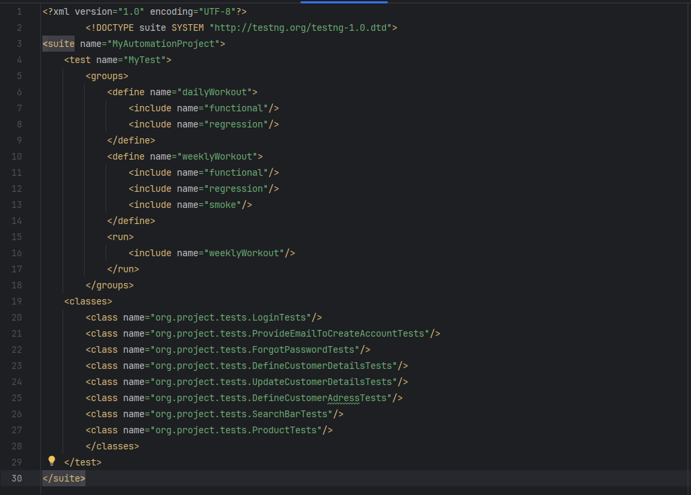
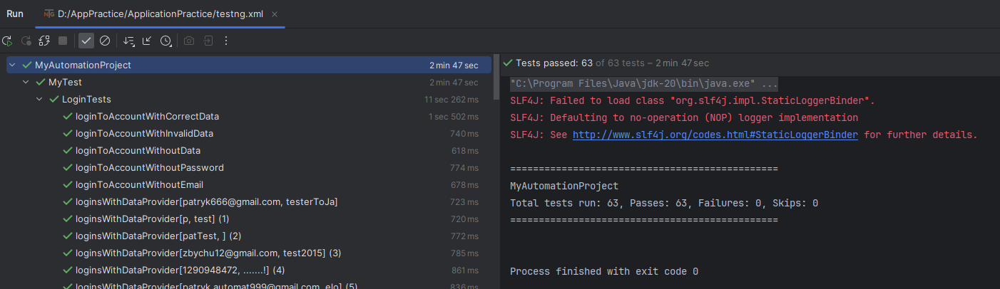
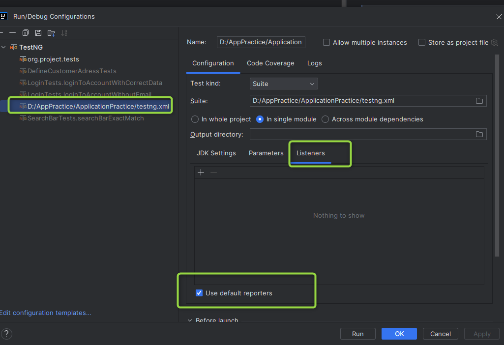
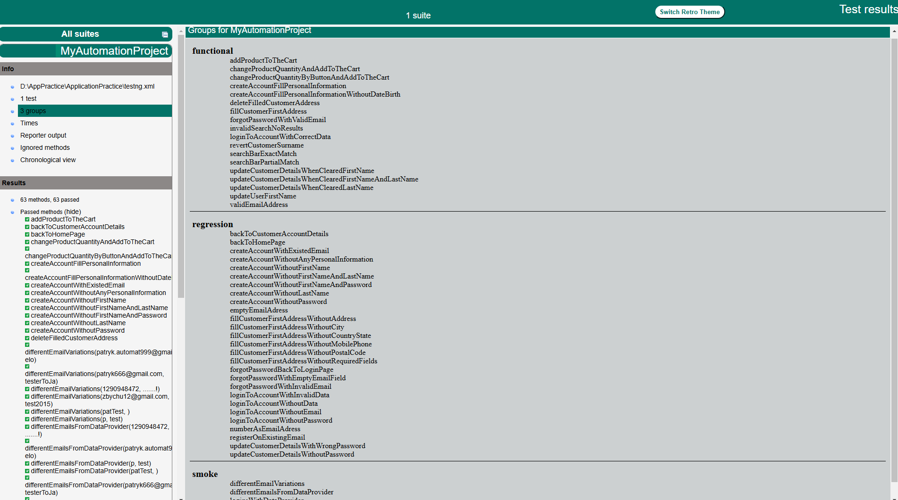

#  *** *Selenium AutomationWebsiteProject* ***

##  *Hello this is my another project on which I have been working on recently* :joy:

### Testing website: 
> http://www.automationpractice.pl/index.php

### Description:
> Private and personal project where I can practice and explore new things. Code is free and open to use.
> I am still working on this and my next goals are:
> * integrate project with Jenkins (my builds are failing so far :collision:)
> * create new pages and tests :sunglasses:
> * refactore code :fire:

### Tools, Frameworks and Methodologies: :shipit:
> * Java programming language
> * Maven
> * Selenium
> * TestNG
> * Jenkins (in progress)
> * DDT (I used JSON file)

All my tests I grouped in to different groups and marked by correct annotations. You can change it if you want and use different approach but remember to
make changes also in XML file. 

### Libraries and Design patterns: :shipit:
> * Faker 
> * POM model
> * ~~POJO~~ switched in to Builder :+1:

At the beginning of my project I used POJO pattern. My class object was small and had only fiew class fields.
As the project developed, I added more and more fields and it turned out that I have 10 fields and my code was long and hard to read.
To avoid many parameters in constructors and configure object in many variations I looked for a replacement.
Customer class represents customer object with all methods and constructor which takes builder parameter :star2:

### Reports
> * TestNG 

This time for generate a report I used TestNG framework. All what you need to do is go to:
Run --> Edit configurations --> Configure TestNG to read data from XML. When you run tests from testng.xml at the end program will create a catalog named: "test-output" with "index.html" file
inside. That`s a report.

